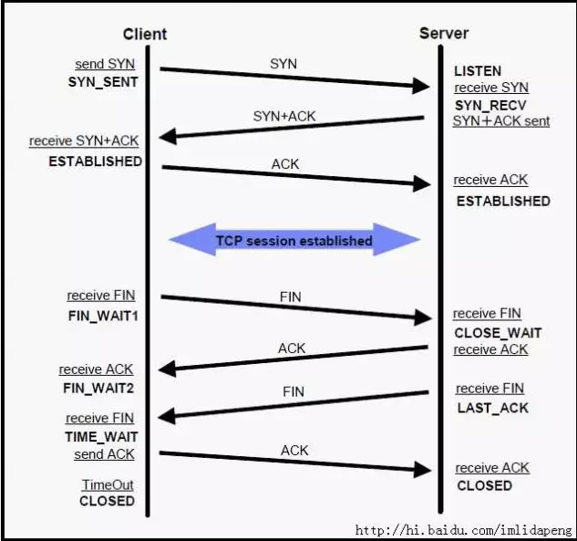

### Setup APT Mirror

Add below mirror link on the top of `/etc/apt/source.list`

```text
#deb china 163.com mirror

deb http://mirrors.163.com/ubuntu/ trusty main restricted universe multiverse
deb http://mirrors.163.com/ubuntu/ trusty-security main restricted universe multiverse
deb http://mirrors.163.com/ubuntu/ trusty-updates main restricted universe multiverse
deb http://mirrors.163.com/ubuntu/ trusty-proposed main restricted universe multiverse
deb http://mirrors.163.com/ubuntu/ trusty-backports main restricted universe multiverse
deb-src http://mirrors.163.com/ubuntu/ trusty main restricted universe multiverse
deb-src http://mirrors.163.com/ubuntu/ trusty-security main restricted universe multiverse
deb-src http://mirrors.163.com/ubuntu/ trusty-updates main restricted universe multiverse
deb-src http://mirrors.163.com/ubuntu/ trusty-proposed main restricted universe multiverse
deb-src http://mirrors.163.com/ubuntu/ trusty-backports main restricted universe multiverse
```

### Setup APT Proxy

modify file `/etc/apt/apt.conf`

```text
Acquire::http::proxy "http://host:port/";
Acquire::https::proxy "https://host:port/";
```

### clear proxy from env

```bash
echo $http_proxy
unset http_proxy
```

### Init "C/C++ Compile ENV"

```bash
apt-get install build-essential
```

### Set no_proxy with tools

```bash
dconf-editor
```

### Socket Performance

#### FD Max on System level
```bash
more /proc/sys/fs/file-max
```

#### FD usage on System
```bash
more /proc/sys/fs/file-nr
```

#### FD Limit (Current User Per-Process)

```bash
ulimit -n
ulimit -Sn
ulimit -Hn
ulimit -a
```

#### Change Limit forever

modify  

`vi /etc/security/limits.conf`

```text
* soft nofile 65535
* hard nofile 65535
```

effect 

`source /etc/security/limits.conf`

#### TCP Status

```bash
netstat -np | grep tcp
netstat -anop | grep tcp
```



#### network setting

file `/etc/sysctl.conf`

```text
net.ipv4.tcp_tw_reuse = 1
net.ipv4.tcp_tw_recycle = 1
net.ipv4.tcp_fin_timeout = 15
```

effect

`sysctl -p`


other

```bash
more  /proc/sys/net/ipv4/ip_local_port_range
more /proc/sys/net/ipv4/tcp_keepalive_time
more /proc/sys/net/ipv4/tcp_keepalive_intvl
more  /proc/sys/net/ipv4/tcp_keepalive_probes
```

#### all opend FD vid PID

`lsof -p 3243 | wc -l`